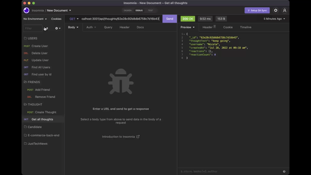

# social-network-api

## Purpose 
Social network web application where users can share their thoughts, react to friends’ thoughts, and create a friend list.

## Table Of Contents
* [General info](#story)
* [Technologies](#built-with)
* [Walkthrough Video](#Walkthrough-video)

## Story
As a social media startup I want an API for my social network that uses a NoSQL database so that my website can handle large amounts of unstructured data

## Built with
* Visual Studio Code
* Express
* Mongoose
* NoSQL

## Walkthrough video

